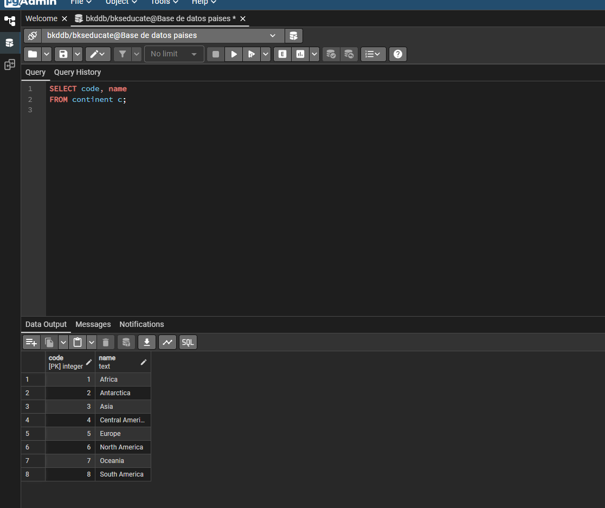

# 🌍 Base de Datos Países - PostgreSQL & Docker

Este repositorio contiene la inicialización y configuración de una base de datos PostgreSQL utilizando Docker Compose, incluyendo la herramienta pgAdmin4 para su administración visual.

## 🛠️ Problemas Encontrados y Soluciones

Durante el despliegue de la infraestructura con Docker, se encontraron y resolvieron múltiples inconvenientes para garantizar un entorno estable y sin conflictos:

### 1. Error de `.devcontainer` faltante
- **Problema:** El servicio `workspace` en `docker-compose.yml` intentaba compilar un contenedor basado en un `Dockerfile` ubicado en `.devcontainer`, directorio que no existía.
- **Solución:** Se eliminó el servicio `workspace` del archivo `docker-compose.yml`, ya que los servicios esenciales (PostgreSQL y pgAdmin) son suficientes para este caso de uso.

### 2. Conflictos de Nombres de Contenedores y Puertos
- **Problema:** Al ejecutar `docker-compose up -d`, los nombres `postgres_db` y `pgadmin_web`, así como los puertos `5433` y `8081`, entraban en conflicto con otro contenedor del usuario.
- **Solución:** 
  - Se modificó `.env` asignando los puertos `5434` (PostgreSQL) y `8082` (pgAdmin).
  - Se renombraron los contenedores a `postgres-db-paises` y `pgadmin-web-paises`.
  - Se crearon volúmenes y redes independientes (`postgres_network_paises`) para aislar completamente el entorno.

### 3. Validación de Hostname en pgAdmin (CSRF & DNS)
- **Problema:** pgAdmin arrojaba el error *"Host name must be valid hostname or IPv4 or IPv6 address"* debido a que el estándar de DNS (RFC 1123) no permite guiones bajos (`_`) en los nombres de host.
- **Solución:** Se reemplazaron todos los guiones bajos por guiones medios (`-`) en los nombres de servicio y contenedor dentro del `docker-compose.yml` (ej. de `postgres_db_paises` a `postgres-db-paises`).

### 4. Inicialización Automática del Esquema
- **Problema:** Inicialmente, solo se contaban con scripts de tipo `INSERT`. Era necesario estructurar y limpiar las tablas asegurando las restricciones (como permitir `Central America`).
- **Solución:** Se creó el archivo `init/00-schema.sql` usando convenciones de `DROP TABLE IF EXISTS ... CASCADE` y definiendo explícitamente los `CREATE TABLE` antes de la inserción de datos.

---

## 🚀 Despliegue y Ejecución

Para iniciar el entorno, simplemente ejecuta:
```bash
docker-compose up -d
```

Accede a pgAdmin en `http://localhost:8082` y registra el servidor usando `postgres-db-paises` como Host en el puerto `5432`.

## 📊 Resultado Esperado

Al ejecutar la consulta requerida para poblar la tabla `continent`:

```sql
INSERT INTO continent (name)
SELECT DISTINCT continent
FROM country
ORDER BY continent ASC;
```

El resultado de los continentes debe verse de la siguiente manera:


